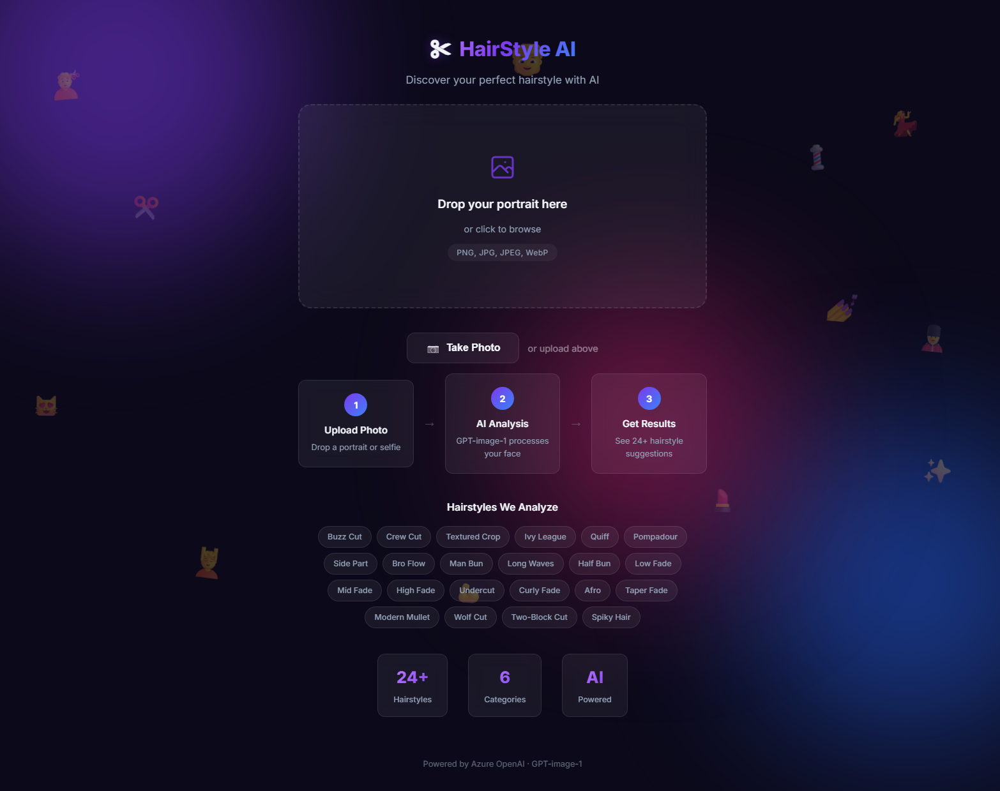
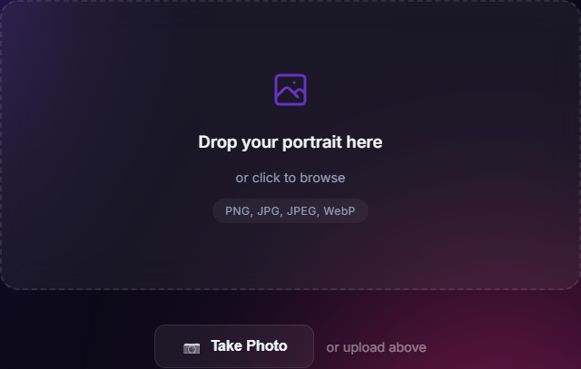
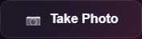
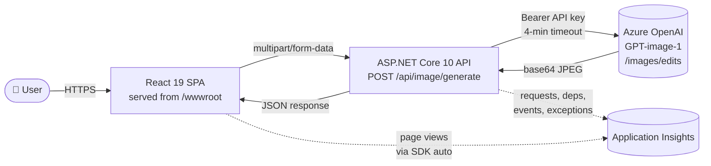

# ✂️ HairStyle AI — AI-Powered Hairstyle Analysis

Upload (or capture) a portrait and let **Azure OpenAI GPT-image-1** generate a stylized hairstyle analysis with 24+ suggestions. Built end-to-end with a **React 19** frontend, an **ASP.NET Core 10** backend, and a single **Azure App Service** that hosts both.

[](https://dotnet.microsoft.com/)
[](https://react.dev/)
[](https://azure.microsoft.com/products/ai-services/openai-service)
[](https://learn.microsoft.com/azure/azure-monitor/app/app-insights-overview)
[](#-license)

🌐 **Live demo:** **https://hair-style-recommendations.azurewebsites.net**
❤️ **Health check:** https://hair-style-recommendations.azurewebsites.net/health

---

## 📸 Screenshots

### Landing page
The drag-and-drop upload zone, **Take Photo** capture button, three-step explainer, and the full grid of supported hairstyles.



### Upload card & take-photo button
Glassmorphism card with drop zone and the camera-capture entry point.

| Upload card | Take Photo button |
|:---:|:---:|
|  |  |

---

## ✨ Features

### End-user
- 🖼️ **Drag & drop or click to browse** for a portrait (PNG / JPG / JPEG / WebP)
- 📷 **In-browser camera capture** — front/back camera toggle, mirrored selfie preview, full-screen modal
- 🎨 **7 style presets** — Original, Anime, Pixar, LinkedIn headshot, Cyberpunk, Watercolor, Retro
- 💇 **24+ hairstyle suggestions** across 6 categories (Short, Medium, Long, Fade & Undercut, Curly & Textured, Trendy)
- ✨ **Glassmorphism UI** — animated gradient background, ambient floating emojis, dark theme
- 🔄 **Reset / Try another photo** flow + image download
- 📱 **Fully responsive** — desktop, tablet, mobile (camera modal switches to portrait aspect on small screens)

### Operational
- 🩺 **`/health` endpoint** wired to App Service health probe → unhealthy instances are auto-rotated
- 📈 **Application Insights** — auto-instrumented requests + custom telemetry: `HairstyleGenerated` event, `Azure OpenAI` dependency tracking, exception tagging with style/timeout reasons
- 🛡️ **CORS lockdown** — production origins set via `Cors__AllowedOrigins__0/1` env vars (no wildcards in prod)
- 🔐 **Secrets in App Settings** — `AzureOpenAI__Endpoint`, `AzureOpenAI__ApiKey`, `AzureOpenAI__Deployment` injected as env vars; never committed to source
- ⏱️ **4-minute named `HttpClient`** for the slow Azure OpenAI image-edits call (under App Service's ~230 s LB ceiling)
- 🚦 **Standardized error responses** — RFC 7807 Problem Details, `UseExceptionHandler`, `UseStatusCodePages`
- 🛑 **Explicit 504 mapping** for upstream HttpClient timeouts so the SPA can show a friendly retry message

---

## 📐 Architecture

### High-level flow



### Hosting topology

The **frontend and backend live in the same Azure resource group** but on **two different App Services** (both Windows, **Basic** tier, sharing one App Service Plan in **Canada Central**):

| Tier | URL | Hosts | Purpose |
|------|-----|-------|---------|
| Frontend | `hair-style-recommendations.azurewebsites.net` | `WebHost` (.NET 10) | Serves the compiled React build from `wwwroot` + SPA fallback |
| Backend | `hairstylesgenerator-htdzbqfycafwfpey.canadacentral-01.azurewebsites.net` | `Backend` (.NET 10) | Calls Azure OpenAI, returns base64 JPEG |

The frontend `WebHost` project is a tiny ASP.NET Core 10 static-file server. Its `.csproj` pulls the React build into `wwwroot` at publish time:

```xml
<ItemGroup>
  <Content Include="..\frontend\build\**\*">
    <Link>wwwroot\%(RecursiveDir)%(Filename)%(Extension)</Link>
    <CopyToPublishDirectory>PreserveNewest</CopyToPublishDirectory>
  </Content>
</ItemGroup>
```

### Request lifecycle

1. User uploads (or captures) a portrait in the React SPA
2. SPA POSTs `multipart/form-data` to the backend at `REACT_APP_API_BASE` (build-time env var → `.env.production`)
3. Backend reads the `IFormFile`, repackages it as a `multipart/form-data` body
4. Backend calls Azure OpenAI `/openai/deployments/{deployment}/images/edits?api-version=2025-04-01-preview`
   - `prompt`: hairstyle analysis prompt (varies by selected style preset)
   - `n: 1`, `size: 1024x1024`, `quality: medium`, `output_format: jpeg`, `output_compression: 100`
   - **Named HttpClient `"AzureOpenAI"` with 4-minute timeout** + `HttpContext.RequestAborted` propagation
5. Azure OpenAI returns `{ "data": [{ "b64_json": "..." }] }`
6. Backend tracks: `Azure OpenAI` dependency (success/duration), `HairstyleGenerated` custom event, exceptions with `reason` tag
7. Backend returns base64 string to the SPA, which renders it inline

---

## 🛠️ Tech Stack

| Layer | Technology |
|-------|------------|
| Frontend | React 19.2, axios 1.16, react-scripts 5 |
| Backend | ASP.NET Core 10, `Microsoft.ApplicationInsights.AspNetCore` 2.23, Microsoft.AspNetCore.OpenApi 10 |
| Frontend host | ASP.NET Core 10 static-file server (`UseDefaultFiles` / `UseStaticFiles` / `MapFallbackToFile("index.html")`) |
| AI model | Azure OpenAI **GPT-image-1**, API version `2025-04-01-preview` |
| Hosting | Azure App Service (Windows, Basic SKU, .NET 10, x64, HTTP/2, Always On, health-check probe) |
| Telemetry | Application Insights (auto-instrumentation + custom events / dependencies / exceptions) |
| Camera | Browser `MediaDevices.getUserMedia` (HTTPS-only — App Service satisfies) |
| Styling | Hand-rolled CSS — glassmorphism, animated gradient bg, mobile-responsive |

---

## 📋 Prerequisites

- [**.NET 10 SDK**](https://dotnet.microsoft.com/download/dotnet/10.0) (10.0.203+)
- [**Node.js 18+**](https://nodejs.org/) and npm
- An **Azure OpenAI** resource with a **GPT-image-1** deployment
  - Recommended regions: **East US**, **West US 3**, **Sweden Central**
  - You'll need: **Endpoint URL**, **API Key**, **Deployment Name**
- (Optional) Azure CLI 2.60+ if you want to deploy

---

## 🚀 Local development

### 1. Clone

```bash
git clone https://github.com/NagaSanthoshMalipeddy/HairStylesGenerator.git
cd HairStylesGenerator
```

### 2. Configure backend secrets

Edit [AIImageProject/Backend/appsettings.json](AIImageProject/Backend/appsettings.json) (or use `dotnet user-secrets` / env vars):

```jsonc
{
  "AzureOpenAI": {
    "Endpoint":   "https://YOUR-RESOURCE.openai.azure.com/",
    "ApiKey":     "YOUR-AZURE-OPENAI-API-KEY",
    "Deployment": "YOUR-DEPLOYMENT-NAME"
  }
}
```

> ⚠️ **Endpoint must end with `/`** and **must NOT have surrounding quotes** when set via env vars (the latter is the most common deployment bug — see [Troubleshooting](#-troubleshooting)).

### 3. Run the backend

```bash
cd AIImageProject/Backend
dotnet restore
dotnet run
# → http://localhost:5187
# → http://localhost:5187/health  (returns 200 "Healthy")
```

### 4. Run the frontend

In a new terminal:

```bash
cd AIImageProject/frontend
npm install
npm start
# → http://localhost:3000
```

The dev server proxies API calls to `http://localhost:5187` by default. To override, set `REACT_APP_API_BASE` before `npm start`.

---

## ☁️ Deploy to Azure

The repo includes the production `WebHost` project so you can host the React build under the same App Service runtime.

```powershell
# 1. Build the React app
cd AIImageProject/frontend
$env:CI = "true"; npm run build

# 2. Publish the .NET WebHost (which copies frontend/build into wwwroot)
cd ../WebHost
dotnet publish -c Release -o .\bin\publish --nologo /p:UseAppHost=false
Compress-Archive -Path .\bin\publish\* -DestinationPath .\bin\WebHost.zip -Force

# 3. Deploy to App Service
az webapp deploy `
    --name hair-style-recommendations `
    --resource-group PersonalProjects `
    --src-path .\bin\WebHost.zip `
    --type zip
```

Backend deploy is identical — publish [AIImageProject/Backend/Backend.csproj](AIImageProject/Backend/Backend.csproj), zip, and `az webapp deploy` to the backend App Service.

### Required App Settings (set on the backend App Service)

| Key | Example value |
|-----|---------------|
| `AzureOpenAI__Endpoint` | `https://YOUR-RESOURCE.openai.azure.com/` |
| `AzureOpenAI__ApiKey` | *(secret)* |
| `AzureOpenAI__Deployment` | `hairstyle-image-generator` |
| `Cors__AllowedOrigins__0` | `https://hair-style-recommendations.azurewebsites.net` |
| `APPLICATIONINSIGHTS_CONNECTION_STRING` | *(your App Insights connection string)* |

The frontend `.env.production` only needs `REACT_APP_API_BASE` pointing at the backend URL.

---

## 📁 Project structure

```
HairStylesGenerator/
├── README.md
├── .gitignore
├── docs/
│   └── screenshots/                    # Live-site screenshots used in this README
├── AIImageProject/
│   ├── AIImageProject.sln
│   ├── Backend/                        # ASP.NET Core 10 API (calls Azure OpenAI)
│   │   ├── Backend.csproj
│   │   ├── Program.cs                  # AppInsights, CORS, Health, ProblemDetails, named HttpClient
│   │   ├── Controllers/
│   │   │   └── ImageController.cs      # POST /api/image/generate (4-min timeout, 504 on upstream timeout)
│   │   └── appsettings.json            # Placeholders only — real values via App Settings / env vars
│   ├── WebHost/                        # ASP.NET Core 10 host that serves the React build
│   │   ├── WebHost.csproj              # <Content Include="..\frontend\build\**\*"> → wwwroot
│   │   └── Program.cs                  # UseDefaultFiles + UseStaticFiles + /health + SPA fallback
│   └── frontend/                       # React 19 SPA
│       ├── package.json
│       ├── .env.production             # REACT_APP_API_BASE → backend URL
│       ├── public/
│       │   └── staticwebapp.config.json
│       └── src/
│           ├── App.js                  # Main component — upload + camera + style presets
│           ├── App.css                 # Glassmorphism, camera modal, animations
│           ├── index.js
│           └── index.css
```

---

## 🔌 API reference

### `POST /api/image/generate`

Generates a hairstyle analysis from a portrait.

**Request**

| Field | Type | Notes |
|-------|------|-------|
| Content-Type | `multipart/form-data` | |
| `image` | file | PNG / JPG / JPEG / WebP, recommended < 4 MB |
| `style` *(optional)* | string | One of: `default`, `anime`, `pixar`, `linkedin`, `cyberpunk`, `watercolor`, `retro` |

**Response — 200 OK**

```json
{ "image": "<base64-encoded JPEG>" }
```

**Error responses**

| Status | When | Notes |
|--------|------|-------|
| 400 | No image attached or invalid form data | RFC 7807 Problem Details |
| 499 | Client cancelled the request | `HttpContext.RequestAborted` triggered |
| 502 | Azure OpenAI returned an error | Includes upstream status & body in App Insights |
| 504 | `HttpClient` timeout (4 min) | Tagged in App Insights with `reason: HttpClientTimeout` |

### `GET /health`

Returns `200 Healthy` when the process is up. Wired to the App Service Health Check probe.

---

## 📊 Observability

Application Insights captures:

- **Requests** — every HTTP request to the API (status, duration, URL)
- **Dependencies** — every outbound call (custom dependency `Azure OpenAI` includes deployment name, image size, duration, success flag)
- **Custom events** — `HairstyleGenerated` with `style` property
- **Exceptions** — including `reason` tag (e.g. `HttpClientTimeout`, `UpstreamError`)
- **Live metrics** — request rate, failure rate, server response time

Useful KQL queries:

```kusto
// Slow image generations over the last 24h
dependencies
| where timestamp > ago(24h)
| where type == "Azure OpenAI"
| summarize p50=percentile(duration, 50), p95=percentile(duration, 95), failures=countif(success == false) by bin(timestamp, 1h)
| render timechart

// Style preset popularity
customEvents
| where name == "HairstyleGenerated"
| summarize count() by tostring(customDimensions.style)
| order by count_ desc
```

---

## 🐛 Troubleshooting

| Symptom | Likely cause | Fix |
|---------|--------------|-----|
| `UriFormatException: Invalid URI: The URI scheme is not valid` | App Setting `AzureOpenAI__Endpoint` was saved with literal double-quotes around the value | Re-set without quotes: `az webapp config appsettings set --settings AzureOpenAI__Endpoint=https://...com/` |
| `TaskCanceledException` after ~100 s | Default `HttpClient.Timeout` is 100 s but image-edits can take 1–3 min | Use the named `"AzureOpenAI"` client (already wired with 4-min timeout in `Program.cs`) |
| 504 returned to the SPA | Backend's 4-min `HttpClient` timeout was hit | Retry with a smaller image; check Azure OpenAI region capacity |
| CORS error in browser console | Frontend origin missing from `Cors__AllowedOrigins__N` | Add the origin and restart the App Service |
| 401 Unauthorized from Azure OpenAI | `AzureOpenAI__ApiKey` wrong or rotated | Re-set the App Setting |
| 404 Not Found from Azure OpenAI | `Deployment` name doesn't match Azure AI Foundry | Verify in [Azure AI Foundry portal](https://ai.azure.com/) |
| `getUserMedia` fails on the deployed site | Browser blocks camera over HTTP | App Service is HTTPS — make sure the URL is `https://...` |
| `Health check failed` on App Service | `/health` not reachable | Confirm `app.MapHealthChecks("/health")` and that Always On = enabled |

---

## 🔒 Security notes

- **No secrets in source.** [appsettings.json](AIImageProject/Backend/appsettings.json) ships with placeholders only; real values live in App Settings / env vars.
- **Production CORS is locked** to the SPA origin via `Cors__AllowedOrigins__0`. The wildcard fallback only activates when no origins are configured (dev convenience).
- **HTTPS-only** — `UseHttpsRedirection` and `UseHsts` are enabled in production builds; App Service enforces TLS 1.2+ at the front door.
- **Static-asset security headers** are set in `staticwebapp.config.json` (X-Content-Type-Options, X-Frame-Options).
- The backend never logs the API key. Custom telemetry tags use stable, non-PII fields (`style`, `reason`, etc.).

---

## 🗺️ Roadmap

- [ ] Switch backend auth from API key → Managed Identity + Microsoft Entra
- [ ] Server-side caching for repeat uploads (image hash → result)
- [ ] Before / after slider in the result view
- [ ] Image gallery + favorites (per-user, requires auth)
- [ ] Push to Azure Container Apps for auto-scale
- [ ] Add Playwright E2E tests in CI

---

## 📄 License

MIT — see source headers and dependencies for individual notices.

---

**Built with .NET 10, React 19, and Azure OpenAI GPT-image-1.**
